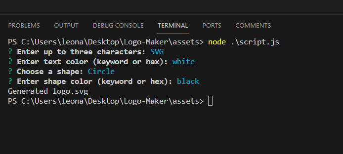
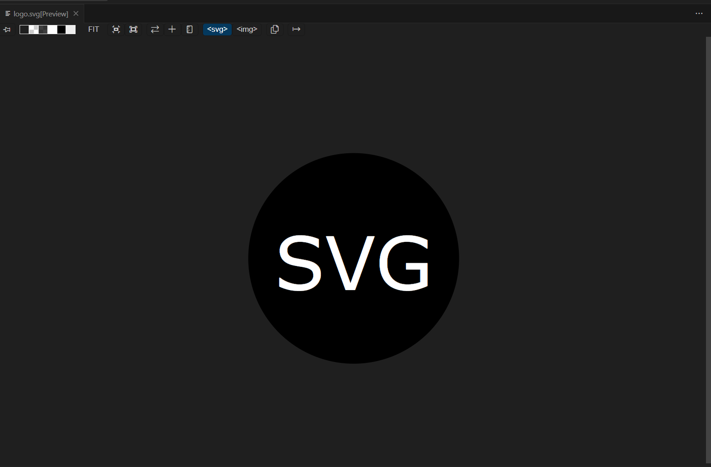

# Logo-Maker

## Summary
This Node.js application allows users to create a simple SVG logo via a command-line interface. The user can specify text, text color, a shape, and the shape's color. The application then generates an SVG file based on these inputs.

## How to use
Custom Text: Enter up to three characters for your logo.
Text Color: Choose the color of your text either by keyword or hexadecimal value.
Shape Selection: Select from a list of shapes (circle, triangle, square) using arrow keys.
Shape Color: Specify the color of your shape, either by keyword or hexadecimal value.
SVG Output: Generates a logo.svg file with your custom design.

## Images

